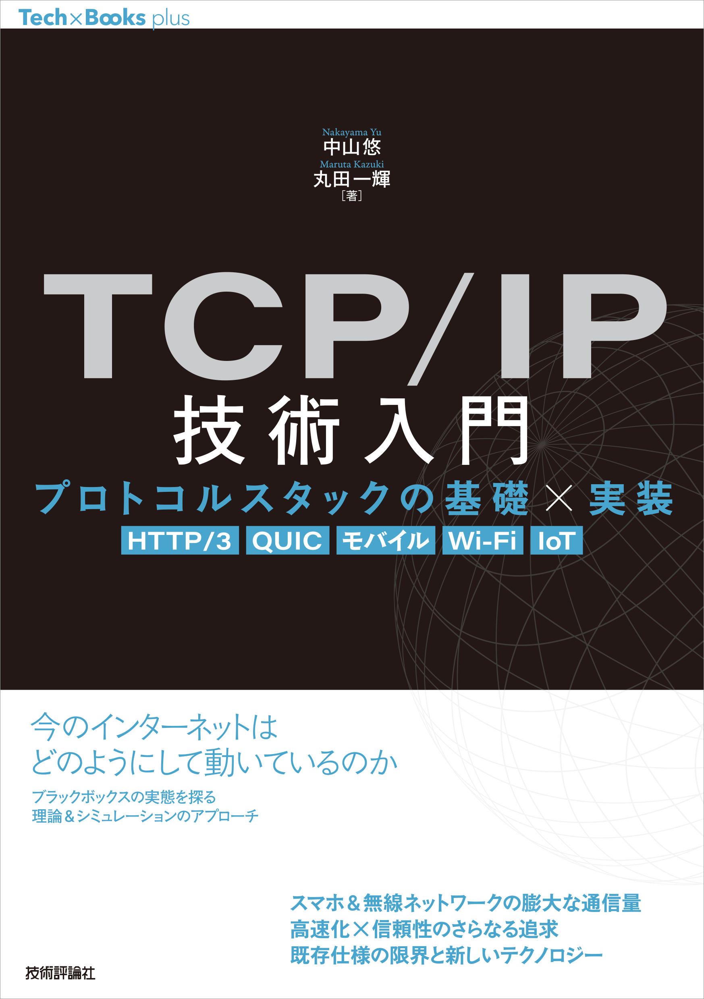
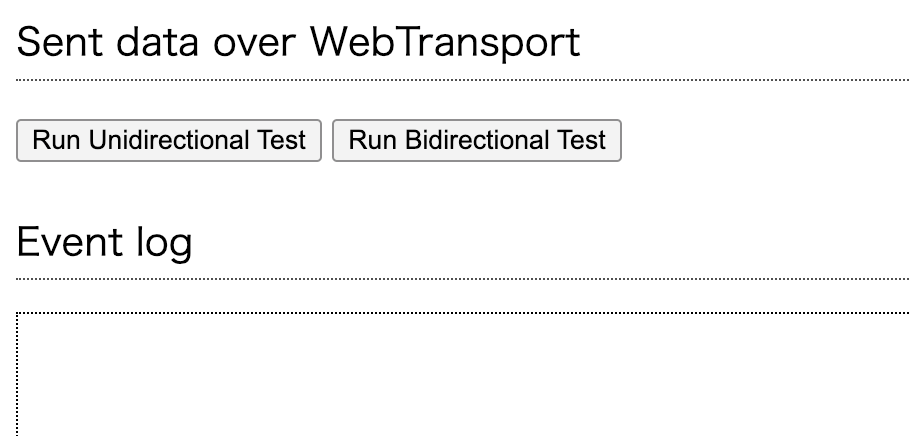

# tcpcip-book
TCP/IP技術入門のサポートページです。




## 本書で登場するサンプルコードと動作確認環境について


### 4章　

➡[MATLAB︎ソースコード](./csma_ca/)

- OS　Windows 11 Pro 23H2
- プロセッサ　2.9 GHz Intel Core i7
- メモリ　16GB 4267 MHz LPDDR4
- MATLAB　2022a（ツールボックスは不使用）


### 6章

既刊『[TCP技術入門](https://gihyo.jp/book/2019/978-4-297-10623-2/)』（技術評論社、2019）の動作確認環境を使用し、VirtualBoxとVagrantとX Serverで基本的に仮想マシン上でシミュレーションを行っています。

- OS　macOS Mojave（v10.14.3）
- プロセッサ　2.9 GHz Intel Core i7
- メモリ　16GB 2133 MHz LPDDR3
- VirtualBox　6.0.4r128413
- Vagrant　2.2.4

なお、VirtualBoxでは次の環境で仮想マシンを立ち上げ、動作確認しています。

- Ubuntu 16.04
- Wireshark 2.6.5
- ns-3（3.27）
- Python 3.5.2
- GCC 5.4.0
- make 4.1

6章の解説にあたりns-3やUbuntuのバージョンに制約があり、動作環境について詳しく知りたい方は『TCP技術入門』とその補足情報を参照してみてください。

- 『[TCP技術入門](https://gihyo.jp/book/2019/978-4-297-10623-2/)』とその[補足情報](https://gihyo.jp/book/2019/978-4-297-10623-2/support/)


### 8章

➡[quic-goソースコード](./quic_go/)
➡[webtransport-goソースコード](./webtransport-go/)

- OS　macOS Ventura（v13.1）
- プロセッサ　1.6GHz デュアルコア Intel i5
- メモリ　8GB 2133 MHz LPDDR3
- Go言語　1.20.5
- quic-go　0.33.0
- webtransport-go　0.5.3

## 環境構築


### quic-go

8章「8.1. Go言語によるQUICの実装」に記載の、quic-go利用に関する解説です。
本リポジトリにある「quic-go」(./quic-go)をダウンロードすると、以下のような構成になっています。

```
quic-go
├── test
│   ├── client
│   │   └ http3-client.go
│   └── server
│       └ http3-server.go
├── ...
```

以下のコマンドにより、[サーバ側コード](./quic-go/test/http3-server.go)を実行し、サーバのプロセスを動かします。

```
% go run server/http3-server.go
```

以下のコマンドで、[クライアント側コード](./quic-go/test/http3-client.go)を実行します。

```
% go run client/http3-client.go
hello world!
```

このように、"hello world!"メッセージを取得できれば成功です。


### webtransport-go

8章「8.3. WebTransportによる通信」に記載の、WebTransport利用に関する解説です。
本リポジトリにある「webtransport-go」(./webtransport-go)をダウンロードすると、以下のような構成になっています。

```
webtransport-go
├── interop
│   ├── index.html
│   ├── interop.py
│   └── main.go
├── ...
```

以下のコマンドで、サーバを起動します。

```
go run main.go
```

Webブラウザを起動し、localhost:8080/webtransportからサーバへアクセスします。
Chromeを起動すると、図のような画面が表示されます。
データの送信方法を選択できるようになっています。
アクセス先URLはデフォルトで入力されており、このときのアクセス先は、先ほど用意したローカルサーバです。




## 正誤表

本書の正誤情報は以下のページで公開しています。

https://github.com/flyby-yunakayama/tcpcip-book/wiki/errata

本ページに掲載されていない誤植など間違いを見つけた方は、[技術評論社の問い合わせページ](https://gihyo.jp/site/inquiry/book?ISBN=978-4-297-14157-8)までお知らせください。


## 著者プロフィール

### 中山悠　Nakayama yu
2006年東京大学農学部卒業、2008年東京大学大学院新領域創成科学研究科自然環境学専攻修了、同年日本電信電㈱入社。2018年東京大学大学院情報理工学系研究科電子情報学専攻博士課程修了。博士（情報理工学）。2019年より東京農工大学大学院工学府・准教授。特定非営利活動法人neko 9 Laboratories 理事長。2022年より㈱Flyby代表取締役、2024年より㈱UMINECO代表取締役も兼務し、大学発技術の社会実装に取り組む。

### 丸田一輝　Maruta Kazuki
2006年九州大学工学部卒業、2008年九州大学大学院システム情報科学府知能システム学専攻修了、同年日本電信電話㈱入社。2016年九州大学大学院システム情報科学府情報知能工学専攻博士後期課程修了。博士（工学）。千葉大学・助教、東京工業大学・特任准教授を経て、2022年4月より東京理科大学工学部電気工学科・准教授。無線ネットワークにおける干渉低減技術の研究に従事。2017年度電子情報通信学会論文賞、RCS研究会最優秀貢献賞等。
